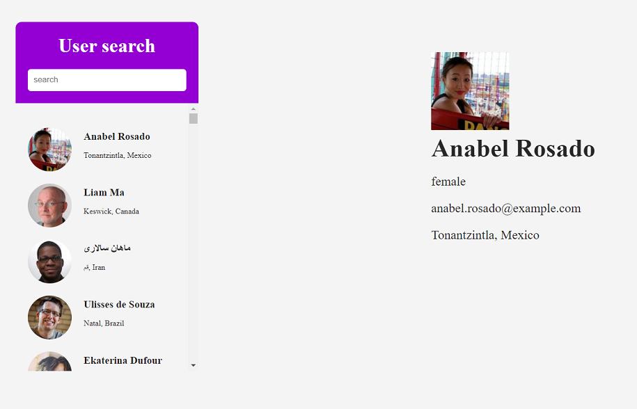

React Demo User Search App
> reactSimpleUserSearch


 ## [Demo](https://gregarious-concha-e60a6a.netlify.app/)



## Tools


A little app searches for fake users and gets their profiles.

Free fake user profile list [API](https://randomuser.me/)

## Development setup

Getting Started with Create React App

This project was bootstrapped with [Create React App](https://github.com/facebook/create-react-app).

## Available Scripts

In the project directory, you can run:

```sh
npm install
npm start
```

Runs the app in the development mode.\
Open [http://localhost:3000](http://localhost:3000) to view it in your browser.


## Meta

 Nijat Gurbanov

- Github: [github.com/NikoFX](https://github.com/NikoFX)
- Twitter: [Nijat Gurbanov](https://twitter.com/)
- Linkedin: [linkedin.com/in/nijat-gurbanov-dev](https://www.linkedin.com/in/nijat-gurbanov-dev/)

## Contributing

1. Fork it
2. Create your feature branch (`git checkout -b feature/fooBar`)
3. Commit your changes (`git commit -am 'Add some fooBar'`)
4. Push to the branch (`git push origin feature/fooBar`)
5. Create a new Pull Request
